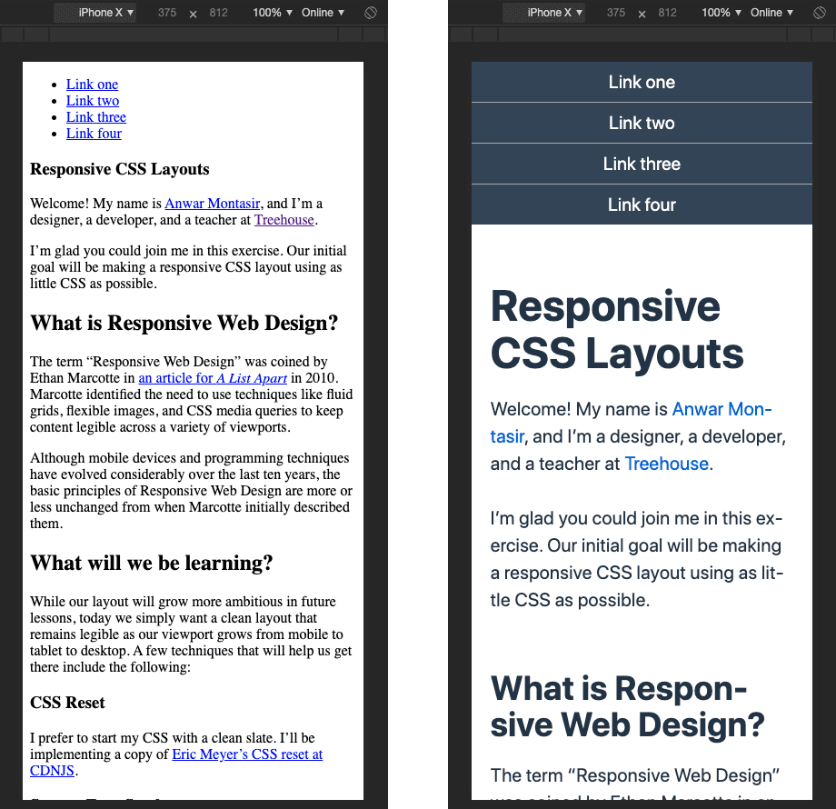

# Responsive CSS Layouts

Starter files for a Treehouse livestream called Responsive CSS Layouts. Project by [Anwar Montasir](https://github.com/anwarmontasir).

## Lesson one

In lesson one, we’ll be taking an unstyled HTML page and creating responsive CSS to make the layout legible across browsers.

